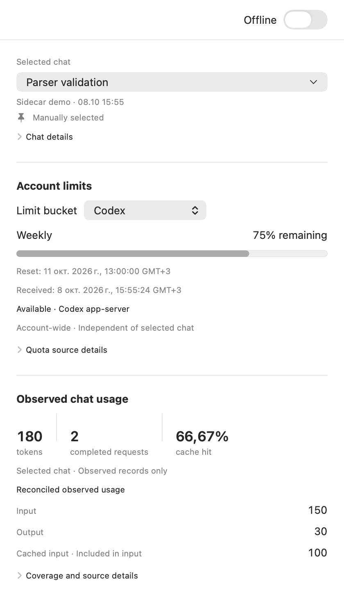
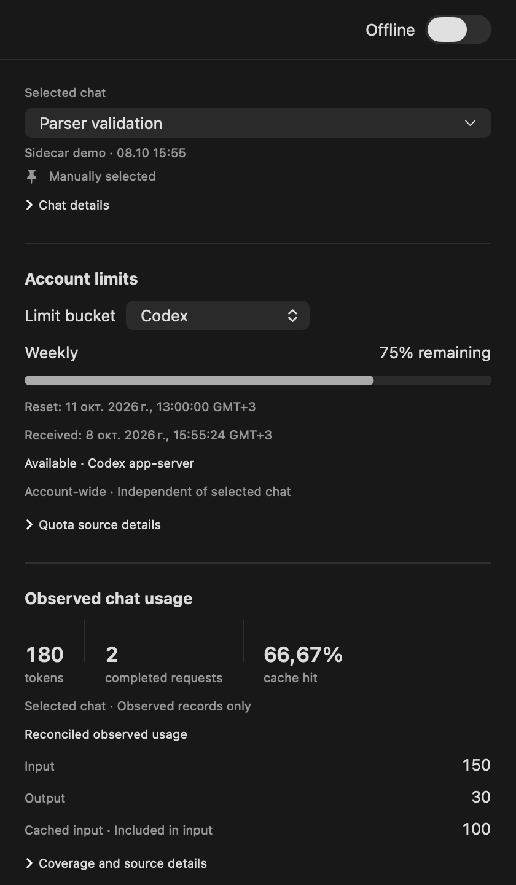
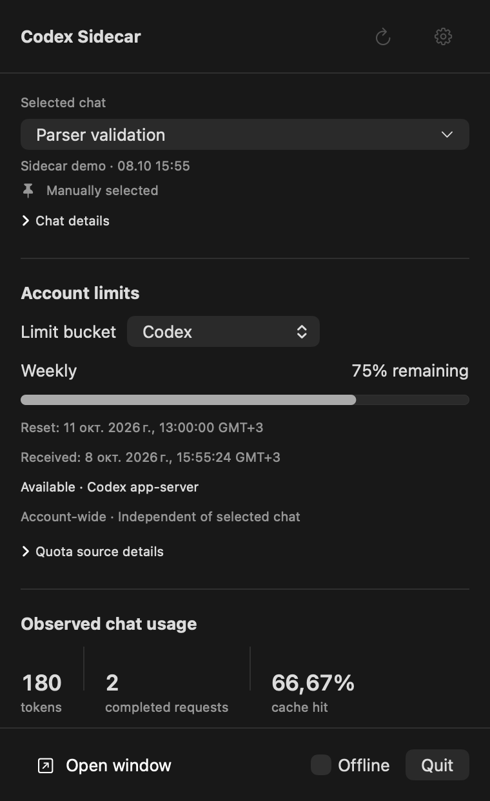
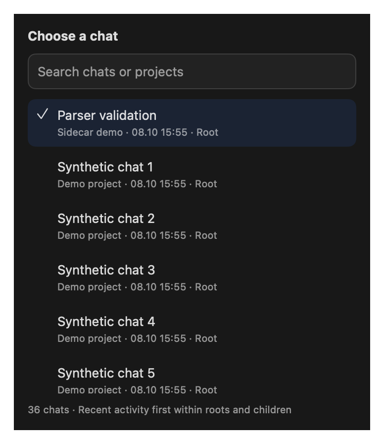

# Codex Sidecar

A passive macOS companion for Codex, with a menu-bar panel and a resizable
companion window sharing one manually selected local chat. Built with Swift 6,
SwiftUI and Foundation; no third-party runtime dependencies or metrics database.

**[Download 0.1.0](https://github.com/Gerionil/codex-sidecar/releases/tag/v0.1.0)** ·
[Installation guide](docs/INSTALL.md) · [Release notes](docs/releases/0.1.0.md)

An independent community project by **Gerionil**, not affiliated with OpenAI.
Free and open source under the [MIT license](LICENSE).

## What it shows

- Account quota buckets and reset times, when available from Codex.
- Observed tokens, completed requests and cache metrics for a selected chat.
- Model/window metadata, paginated request details and compact task activity.
- Shared selection in the menu-bar panel and companion window.
- System, Light and Dark appearance and an Offline switch.

Sidecar does not create model requests. It processes local records and uses a
separate Codex process for passive account quota reads when online.

## Preview

Native interface renders from the current source with **synthetic demonstration
data**. They contain no real chats, account information or user logs.

<table>
  <tr><th>Light</th><th>Dark</th></tr>
  <tr>
    <td></td>
    <td></td>
  </tr>
  <tr><th>Menu-bar panel</th><th>Search chats</th></tr>
  <tr>
    <td></td>
    <td></td>
  </tr>
</table>

## Get started

1. Download the **Apple Silicon ZIP** from the release link above.
2. Extract it, move **Codex Sidecar.app** into **Applications**, and open it.
3. If macOS blocks this unsigned preview, follow the [installation guide](docs/INSTALL.md).
4. Use **Selected chat** to choose a local Codex chat. Use the gear button for
   data-location overrides, appearance and Offline settings.

The release has **no Apple Developer ID signature or notarization**. It is checked
on Apple Silicon macOS 27.0.1. Intel is not included; older macOS runtime support
is unverified. Exact current context usage is unavailable, and observed totals
are not guaranteed lifetime usage or billing.

## Current status

Stages 1–5 are implemented and locally merged. **Stage 6 is complete in the
owner-approved current-Mac scope.** The final combined suite passes all 200 tests;
release packaging and independent branch review pass. Native checks and owner
acceptance cover keyboard controls, Offline recovery, selection, theme, lifecycle
and Dock/menu icons. A synthetic append updates both actual native views without
Refresh. Simultaneous natural-response updates on both surfaces were not observed;
VoiceOver is excluded by the owner. See the dated
[validation record](docs/validation.md) for evidence and remaining limits.

The freshly checked CLI profile is **0.160.1** on Apple Silicon macOS 27.0.1.
The declared deployment floor is macOS 14; macOS 14 and Intel runtime support
have not been tested. Windows and Linux are outside this release. The first
public preview is unsigned. Licensed under [MIT](LICENSE), copyright 2026
Gerionil. Apple signing and notarization are deferred by the owner.

## Build, test and package

Use a Swift 6 toolchain with the macOS SDK and XCTest available. The validated
host uses Apple Swift 6.4 with the active Xcode SDK 27.0. No tools are installed
by these instructions.

```sh
swift test
swift build -c release
scripts/package-app.sh
open 'build/Codex Sidecar.app'
```

For restricted environments like the one used for validation, project-local
compiler caches and SwiftPM's `--disable-sandbox` were needed:

```sh
export CLANG_MODULE_CACHE_PATH="$PWD/.build/clang-module-cache"
export SWIFTPM_MODULECACHE_OVERRIDE="$PWD/.build/swift-module-cache"
swift test --disable-sandbox
swift build -c release --disable-sandbox
scripts/package-app.sh --disable-sandbox
```

The packaging script copies the release executable and Info.plist into
`build/Codex Sidecar.app`. The package includes a Dock icon and a monochrome
menu-bar template with Retina resolution. Icon masters and regeneration notes
are in [docs/design/brand](docs/design/brand/README.md). Build outputs and local validation scratch files are
ignored. Packaging does not install, sign, notarize, upload or enable autostart.
To produce the Apple Silicon ZIP with a license, installation guide and checksum,
run `scripts/package-release.sh` (or pass `--disable-sandbox` where required).
The validation sandbox also required narrowly approved execution outside it for
native launch and tests; `--disable-sandbox` alone does not lift the host's outer
sandbox restrictions. Check command failures before treating the app as built.

## Launch and settings

Local Settings allow a Codex root, executable override, offline mode and
System/Light/Dark appearance. Theme changes preserve selection and provider
lifecycles; older saved settings default to System without losing overrides.
The interface uses Codex-inspired light/dark flat surfaces and restrained native
Liquid Glass controls on macOS 26+. Reduce Transparency and macOS 14–15 use
bordered controls. Detailed source metadata is disclosed, while missing/partial
usage and stale/error quota states remain visible. The owner has confirmed native
appearance switching on the current Mac. Root
precedence is explicit override, inherited `CODEX_HOME`, then the current user's
`.codex` directory. A GUI launch may not inherit the shell environment. The same
resolved root is supplied to session discovery and the owned quota process.

Selected chat opens one searchable popover with recent catalog ordering and
stored names. The companion displays five completed requests per page. Activity
starts as a count/status summary; tasks, unattributed calls and associated calls
expand separately, twenty records per page. All history remains reachable.
Offline is also available at the top of the companion window. If a startup
account hint invalidates a pending quota read, Sidecar retries once immediately;
repeated hints use the normal polling schedule. Current metadata contains chat
titles but no semantic titles for individual completed responses.

Executable discovery uses an explicit override, safe absolute PATH entries, then
recognized installed application bundles. Sidecar runs a bounded `--version`
verification without a shell before using an executable. Missing or unverifiable
executables produce an unavailable state. Versions other than the reference
profile are labeled unvalidated; a version match alone is not proof of compatible
capabilities or every possible rollout shape.

Optional launch overrides (replace the example paths with your own):

```sh
open -n 'build/Codex Sidecar.app' --args \
  --isolated-settings \
  --codex-root /absolute/path/to/test-codex-home \
  --codex-executable /absolute/path/to/codex \
  --offline
```

`--isolated-settings` starts from default local settings without reading or
persisting saved Sidecar preferences. `--codex-root` and `--codex-executable`
override their settings; `--offline` disables quotas. For synthetic GUI checks,
provide a test-owned root and fake executable explicitly and verify the running
instance's arguments before binding any UI tool that could auto-launch an app.

Choose a chat manually from **Selected chat** in either surface. Descriptors use
`Project · Chat title · Root/Child · Last activity` when a stored title is available
in the selected root's optional `session_index.jsonl`. Titles are never inferred
from prompts. Missing titles use distinguishable short IDs; duplicate titles in
the same project include an ID suffix. Roots come first, then children; each group
sorts by newest known activity, with stable ID ties. Activity uses the newer of
source modification time and valid indexed update time, so it is a heuristic.
An unavailable, symlinked or over-16-MiB index falls back to IDs; names above 4 KiB
and malformed entries are skipped. Index names refresh during catalog discovery. Selector dates use `dd.MM HH:mm`
in the local time zone, adding a two-digit year for other years. Seconds and time
zone labels remain available in the selected chat details.
The owner confirmed the refined selector; current-Mac native search and selection
checks passed.
Selection stays pinned until changed; recent activity is a suggestion, not
foreground-chat detection. Changing a chat changes its usage, not current-account
quotas. **Open window** is implemented to open/focus the companion; closing the
window keeps the menu-bar app running. **Quit** is implemented to stop owned
readers and quota workers. These focus/reuse/close/reopen/Quit checks passed in the owner-reported synthetic
manual checklist. Native keyboard checks passed; VoiceOver is excluded by the
owner, rather than marked passed.

## Metrics and data boundaries

- Observed tokens sum valid, unique, owned completed-response records present in
  inspected sources. They are not guaranteed lifetime usage or an account bill.
  Reported cumulative usage and reconciliation are shown separately.
- Cached input is included in input; reasoning is included in output. They are
  not added again to total. Cache rate uses summed cached/input values across the
  same validated records. Missing breakdown stays unavailable, never zero.
- Tasks, model requests and tool calls have different scopes. Interrupted or
  failed activity without reported usage has no invented cost. Tool association
  uses validated stream order and preserves ambiguity; inner commands are not
  inspected for read/search counts.
- **Current context usage is unavailable.** Model context window and last-request
  footprint are separate historical metrics. Configured model is not guaranteed
  actual-model attribution through fallback or compaction. No parent/child totals.
- **Current account limits** show dynamic buckets and only returned windows.
  Duration 300 minutes is labeled 5h; 10,080 minutes is Weekly. Weekly-only,
  multiple buckets, duplicate-duration slots and null fields are valid shapes.
  Reset timestamps use Unix seconds. Missing windows are not fabricated.

Files are read locally and incrementally, with bounded framing and periodic
reconciliation. Sidecar retains normalized metrics in memory, not transcripts,
raw logs, credentials or account replies. Optional stored chat names are retained
in memory for display only. Settings persist only local overrides,
session/bucket selection, appearance and offline preference. Restart rebuilds metrics from
original sources; source loss and partial history remain explicit. Large-stream reader measurements and limitations
are recorded in [validation](docs/validation.md).

## Offline and network behavior

Offline mode keeps local session reading available and starts no quota child.
When online, a separately owned `codex app-server` uses Codex-managed authentication
and network traffic for passive account/quota reads, with process-only analytics
disabled. Sidecar does not open authentication files, export credentials, perform
inference, manage chats, login/logout, reset credits or call private quota HTTP
endpoints. Codex itself may perform normal runtime housekeeping or credential
refresh; its internal state is not certified immutable.

Quota polling is independent of chat selection (normally every 60 seconds), with
bounded retries and explicit loading/unavailable/stale/error states. A startup
account notification can invalidate the initial read; scheduled recovery uses
the same process. Last good values remain labeled stale/error after applicable
failures. A past reset is a refresh hint, not proof that usage or permission resets.
Cross-process notification delivery and real account-change behavior remain
unverified; deterministic fake-transport tests cover these state transitions.

## Support development

Codex Sidecar is free and open source. If you find it useful, you can support
development with a voluntary crypto donation. Donations do not unlock features
or include support commitments.

Choose the exact asset and network below. Each QR code contains only the receiving
address; select the matching asset and network in your wallet before sending.

| Asset | Network | Receiving address |
| --- | --- | --- |
| USDT | **TRON (TRC20)** | `TSS5oAt4d4tBLCjr65prTifbxtTe28tuHX` |
| USDC | **Base** | `0x8bf736e7eA5022B09FECe2883052f3d8cE54cB4b` |
| BTC | **Bitcoin** | `bc1q7f7an2zj78zqf6kf275cdvh6az00c5pvdd4lye` |
| LTC | **Litecoin** | `ltc1qqcn7xnefm0zs0nf62w7x4rk3grylzg0hm5a78d` |

<table>
  <tr>
    <th>USDT · TRON (TRC20)</th>
    <th>USDC · Base</th>
  </tr>
  <tr>
    <td></td>
    <td></td>
  </tr>
  <tr>
    <th>BTC · Bitcoin</th>
    <th>LTC · Litecoin</th>
  </tr>
  <tr>
    <td></td>
    <td></td>
  </tr>
</table>

## Project references

- [Specification](SPEC.md) — approved product and accounting boundaries
- [Implementation plan](IMPLEMENTATION_PLAN.md) — stage scope and acceptance
- [Research](docs/research.md) — dated schema/source and installed-profile evidence
- [Validation](docs/validation.md) — fresh checks and scoped acceptance
- [Working instructions](AGENTS.md) — language, privacy and branch workflow

Starter notes and prompts are historical. Current implementation status is above;
the specification supersedes earlier starter hypotheses.
